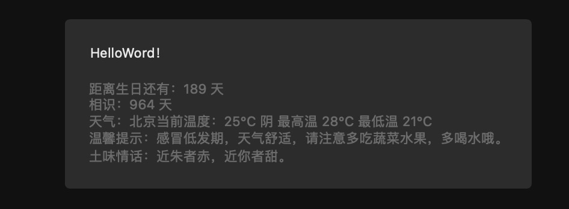
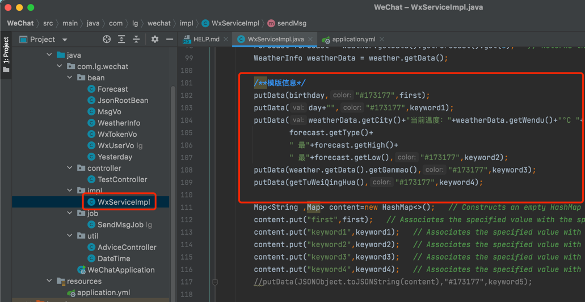
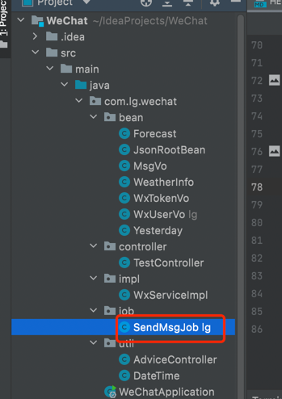

前提条件需要本机电脑有jdk

- 搞一个微信公众平台测试号 https://mp.weixin.qq.com/debug/cgi-bin/sandbox?t=sandbox/login
- 添加一个消息模版(将下面模版复制即可)

```text
  距离生日还有：{{first.DATA}} 天 
  相识：{{keyword1.DATA}} 天 
  天气：{{keyword2.DATA}} 
  温馨提示：{{keyword3.DATA}} 
  土味情话：{{keyword4.DATA}}
```

- 运行jar包

```shell
#如果以申请公众平台测试号将下面草书替换成自己的即可
java -jar WeChat-0.0.1-SNAPSHOT.jar --appId='' --secret='' --tmplId='' --birthday='' --beginDate='' --city=''

```
<table>
    <tr>
        <td>参数</td>
        <td>解释</td>
        <td>事例</td>
    </tr>
    <tr>
        <td>appId</td>
        <td>公众平台测试号的appid</td>
        <td></td>
    </tr>
    <tr>
        <td>secret</td>
        <td>公众平台测试号的secret</td>
        <td></td>
    </tr>
    <tr>
        <td>tmplId</td>
        <td>公众平台测试号的模版id</td>
        <td></td>
    </tr>
    <tr>
        <td>birthday</td>
        <td>生日</td>
        <td>格式：08-22 00:00:00</td>
    </tr>
     <tr>
        <td>beginDate</td>
        <td>相遇时间</td>
        <td>格式：2020-01-01 00:00:00</td>
    </tr>
     <tr>
        <td>city</td>
        <td>城市名称</td>
        <td>用于获取天气信息</td>
    </tr>
    <tr>
        <td>openUserId</td>
        <td>接收信息的用户OpenUserId</td>
        <td>不写默认给所有关注的用户发送</td>
    </tr>


</table>

# 简单方法
```shell
#懒得申请测试号的，需要微信关注一下下面的测试号，然后运行下面的命令
#单引号里的值参考上面表格 （注意=号后面的值用单引号包起来）
java -jar WeChat-0.0.1-SNAPSHOT.jar --birthday='' --beginDate='' --city=''

#事例 不懂的直接粘贴复制
java -jar WeChat-0.0.1-SNAPSHOT.jar --birthday='02-20 00:00:00' --beginDate='2020-01-01 00:00:00' --city='北京'

#浏览器访问 http://127.0.0.1/wx/sendMsg 
```


**效果**



## 修改模版内容


## 直接发送消息
 jar包运行成功后 浏览器访问 http://127.0.0.1/wx/sendMsg
 有个早上8点的定时也会自动发送 （前提是jar一直在运行）  



# 就是调用现成接口，没啥技术含量，大佬勿喷。

